# Website Decode: cyera.com

> **URL:** https://www.cyera.com  
> **Analyzed:** 2026-04-18 13:08 UTC  
> **Page title:** Cyera | AI-Native Data Security for Cloud, SaaS, On-Prem, and AI  
> **Meta description:** Cyera is an AI-native data security platform that helps enterprises discover, classify, govern, and protect sensitive data across cloud, SaaS, on-prem, and AI environments.

---

## 01 Site Structure

**Navigation links:**
- The AI Security PlatformEnable AI readiness, reduce data risk in real time, and continuously strengthen compliance in a single unified platform.Platform Overview → `/platform`
- DSPM → `/platform/dspm`
- Data Loss Prevention → `/platform/data-loss-prevention`
- AI Guardian → `/platform/ai-guardian`
- Privacy → `/platform/privacy`
- Platform Overview → `/platform`
- Latest Releases → `/latest-releases`
- Integrations → `/integrations`
- Enriched Classification → `/platform/enriched-classification`
- Remediation → `/solutions/remediation`
- Access Trail → `/platform/access-trail`
- Identities → `/platform/identity-access`
- Data Subject Request → `/platform/dsr`
- Browser Shield → `/platform/browser-shield`
- DataWatcher → `/datawatcher`
- Data Risk Assessment → `/data-risk-assessment`
- AI Risk Assessment → `/ai-security-readiness-assessment`
- Solving Data & AI SecurityProtect and control your data and AI,  with the speed, scale, and precision  that’s only possible with Cyera.Explore all Solutions → `/solutions`
- Financial Services → `/industries/financial-services`
- Manufacturing → `/industries/manufacturing`
- Tech Services → `/industries/technology-services`
- Healthcare → `/industries/healthcare`
- Retail & Travel → `/industries/retail-and-travel`
- Federal → `/industries/federal`
- Securely Enable AI → `/solutions/securely-enable-ai`
- Insider Threat → `/solutions/insider-threat`
- On-Prem Support → `/solutions/on-prem`
- Data Minimization → `/solutions/data-minimization`
- Public Exposure → `/solutions/public-exposure`
- Secure M365 → `/solutions/m365-attack`
- Compliance Readiness → `/solutions/compliance-readiness`
- Microsoft → `/partnership/microsoft`
- AWS → `/partnership/aws`
- Google Cloud → `/partnership/google-cloud-platform`
- Snowflake → `/partnership/snowflake`
- Cohesity → `/partnership/cohesity`
- Cyera ResearchProtect and control your data and AI, with the speed, scale, and precision that’sCyera Research → `/research`
- Certifications → `/certifications`
- AI Security Pulse Check → `/pulse-check/ai-security`
- DataSecAI School → `https://portal.datasecai.io/hc`
- Blog → `/blog`
- Resource Center → `/resources`
- Webinars → `/webinars`
- Events → `/events`
- Cyera Research → `/research`
- CSO Team → `/office-of-cso`
- Glossary → `/glossary`
- Customer StoriesSee why leading organizations choose to secure their data with CyeraWhy Cyera → `/customer-stories`
- CareersWe're redefining how the world secures its data in the AI era.Join Cyera → `/careers`
- About Us → `/about`
- Trust Center → `https://security.cyera.io/`
- Newsroom → `/newsroom`
- Careers → `/careers`
- Careers IL → `/careers-il`
- Partners → `/partnerships-integrations`
- Contact Us → `/contact-us`
- Customers → `/customer-stories`
- Pricing → `/pricing`
- Customers → `/customer-stories`
- Pricing → `/pricing`
- DSPM → `/platform/dspm`
- Data Loss Prevention → `/platform/data-loss-prevention`
- AI Guardian → `/platform/ai-guardian`
- Privacy → `/platform/privacy`
- Platform Overview → `/platform`
- Latest Releases → `/latest-releases`
- Integrations → `/integrations`
- Enriched Classification → `/platform/enriched-classification`
- Remediation → `/solutions/remediation`
- Access Trail → `/platform/access-trail`
- Identities → `/platform/identity-access`
- Data Subject Request → `/platform/dsr`
- Browser Shield → `/platform/browser-shield`
- DataWatcher → `/datawatcher`
- Data Risk Assessment → `/data-risk-assessment`
- AI Risk Assessment → `/ai-security-readiness-assessment`
- Financial Services → `/industries/financial-services`
- Manufacturing → `/industries/manufacturing`
- Tech Services → `/industries/technology-services`
- Healthcare → `/industries/healthcare`
- Retail & Travel → `/industries/retail-and-travel`
- Federal → `/industries/federal`
- Explore all Solutions → `/solutions`
- Securely Enable AI → `/solutions/securely-enable-ai`
- Insider Threat → `/solutions/insider-threat`
- On-Prem Support → `/solutions/on-prem`
- Data Minimization → `/solutions/data-minimization`
- Public Exposure → `/solutions/public-exposure`
- Secure M365 → `/solutions/m365-attack`
- Compliance Readiness → `/solutions/compliance-readiness`
- Data Privacy → `/platform/data-privacy`
- M&A and Divestitures → `/solutions/m-a-and-divestitures`
- Microsoft → `/partnership/microsoft`
- AWS → `/partnership/aws`
- Google Cloud → `/partnership/google-cloud-platform`
- Snowflake → `/partnership/snowflake`
- Cohesity → `/partnership/cohesity`
- Blog → `/blog`
- Resource Center → `/resources`
- Webinars → `/webinars`
- Events → `/events`
- Cyera Research → `/research`
- CSO Team → `/office-of-cso`
- Glossary → `/glossary`
- Certifications → `/certifications`
- AI Security Pulse Check → `/pulse-check/ai-security`
- DataSecAI School → `https://portal.datasecai.io/hc`
- About Us → `/about`
- Trust Center → `https://security.cyera.io/`
- Newsroom → `/newsroom`
- Careers → `/careers`
- Careers IL → `/careers-il`
- Partners → `/partnerships-integrations`
- Contact Us → `/contact-us`

**Sections found:** 8
🖼️ **1.** `main` — Protect your data.Secure AI. ◀ CTA
🖼️ **2.** `section` — (no heading)
🖼️ **3.** `section` — AIbreaksyourolddefenses.Newchallengesrequireintelligentresponses.
🖼️ **4.** `section` — One platformto secure AI - from data to access to action.
🖼️ **5.** `section` — Traditional classification relies on static rules andlacks context
🖼️ **6.** `section` — Protect and comply at scale by making data and AI securityhighly actionable.
🖼️ **7.** `section` — Additional resources
🖼️ **8.** `section` — Securethe unknown ◀ CTA

## 02 Messaging & Headlines

**H1 (main headline):**
> "Protect your data.Secure AI."

**H2 (section headlines):**
- AIbreaksyourolddefenses.Newchallengesrequireintelligentresponses.
- One platformto secure AI - from data to access to action.
- Traditional classification relies on static rules andlacks context
- The Cyera Advantage
- Protect and comply at scale by making data and AI securityhighly actionable.
- See why security & data leaderslove Cyera
- Additional resources
- Securethe unknown

**H3 (sub-headlines):**
- Speed
- Scale
- Trust
- Outcomes
- Auto-remediate risks quickly and at scale
- Take informed actions with one click

## 03 Calls to Action

- **"Manage Preferences"** → `#`
- **"Get a demo"** → `/demo`
- **"Assess your AI Security"** → `/pulse-check/ai-security`
- **"Read Full Story"** → `/customer-story/paramount-gains-full-data-visibility-with-cyera-identifying-billions-of-sensitive-records`
- **"Book a demo"** → `/demo`
- **"Submit"** → `#`
- **"Button Text"** → `#`

**Forms found:** 3
- Inputs: hidden, hidden, hidden, text, text, email, text, tel, text, checkbox, hidden, hidden, hidden, hidden, hidden, hidden, hidden, hidden, hidden, hidden | Submit: "Submit"
- Inputs:  | Submit: ""
- Inputs:  | Submit: ""

## 04 Typography

- `.w-icon-dropdown-toggle:before{content:""}.w-icon-file-upload-remove:before{content:""}.w-icon-file-upload-icon:before{content:""}*{box-sizing:border-box}html{height:100%}body{color:#333`
- `Arial`
- `Haffer Uprights VF`
- `Helvetica`
- `Helvetica Neue`
- `Inter`
- `Inter var`
- `Season Mix Uprights VF`
- `Segoe UI`
- `Ubuntu`
- `Verdana`
- `aside`
- `canvas`
- `details`
- `figcaption`
- `figure`
- `footer`
- `header`
- `hgroup`
- `main`
- `menu`
- `nav`
- `progress`
- `sans-serif}body{margin:0}article`
- `section`
- `summary{display:block}audio`
- `swiper-icons`
- `video{vertical-align:baseline`
- `webflow-icons`
- `webflow-icons!important}.w-icon-slider-right:before{content:""}.w-icon-slider-left:before{content:""}.w-icon-nav-menu:before{content:""}.w-icon-arrow-down:before`

## 05 Color Palette

| Color | Hex | Role |
|-------|-----|------|
| ██ | `#2A1043` | primary (cool/blue-purple) |
| ██ | `#F3F3F3` | background |
| ██ | `#7E5BB1` | primary (cool/blue-purple) |
| ██ | `#929694` | neutral |
| ██ | `#BBFAA4` | accent (green) |
| ██ | `#C8C7CA` | neutral |
| ██ | `#D8D8D9` | background |
| ██ | `#654281` | primary (cool/blue-purple) |
| ██ | `#DBC9E0` | background |
| ██ | `#BDA2CE` | primary (cool/blue-purple) |
| ██ | `#7C8373` | neutral |
| ██ | `#45B580` | accent (green) |
| ██ | `#D4D4CB` | background |
| ██ | `#E4DBE3` | background |
| ██ | `#5474B4` | primary (cool/blue-purple) |

**CSS custom properties (color tokens):**
- `--_colors---base-color-brand--dark-violet`: `#160923`
- `--_colors---base-color-brand--muted-yellow`: `#eeede7`
- `--_colors---base-color-brand--helio-purple`: `#d390ff`
- `--_colors---base-color-brand--lavender`: `#e8c6ff`
- `--_colors---base-color-brand--pale-purple`: `#f6e8ff`
- `--_colors---base-color-brand--grey`: `#787771`
- `--_colors---base-color-brand--alabaster`: `#f6f5f1`
- `--_colors---base-color-brand--white-smoke`: `#fbfbfb`
- `--_colors---base-color-brand--deep-purple`: `#6d2d93`
- `--base-color-neutral--black`: `#000`
- `--_colors---base-color-brand--ash-taupe`: `#d4d2c8`
- `--_colors---base-color-brand--linen`: `#efefef`
- `--_colors---base-color-brand--charcoal`: `#441363`
- `--_colors---base-color-brand--dolphin`: `#524e56`
- `--_colors---base-color-brand--azure-blue`: `#6880e4`
- `--_colors---base-color-brand--soft-blue`: `#eaedff`
- `--_colors---base-color-brand--midnight-blue`: `#172973`
- `--_colors---base-color-brand--heliotrope-purple`: `#c266ff`
- `--_colors---base-color-brand--forest-green`: `#043a40`
- `--_colors---base-color-brand--pale-green`: `#d5f6f0`

## 06 Animation & Interactions

**Libraries detected:**
- Lottie
- GSAP SplitText
- GSAP ScrollTrigger
- Swiper
- CSS Keyframes
- GSAP

**CSS @keyframes (3 found):**
- `spin`
- `swiper-preloader-spin`
- `os-resize-observer-dummy-animation`

**Transitions (sample):**
- `unset}.w-webflow-badge{white-space:nowrap`
- `none!important}.os-resize-observer{animation-name:os-resize-observer-dummy-animation`
- `.2s transform,.2s top}.swiper-horizontal>.swiper-pagination-bullets .swiper-pagination-bullet,.swiper-pagination-horizontal.swiper-pagination-bullets .swiper-pagination-bullet{margin:0 var(--swiper-pagination-bullet-horizontal-gap,4px)}.swiper-horizontal>.swiper-pagination-bullets.swiper-pagination-bullets-dynamic,.swiper-pagination-horizontal.swiper-pagination-bullets.swiper-pagination-bullets-dynamic{left:50%`
- `background-color .4s}.rsa_tab-link:hover{background-color:var(--_colors---base-color-brand--lavender)}.rsa_tab-link.w--current{border-color:var(--_colors---base-color-brand--deep-purple)`
- `color .4s,background-color .4s}.resources_navigation-button:hover{background-color:var(--_colors---base-color-brand--white)`
- `color .4s,background-color .4s}.event_navigation-button:hover{background-color:var(--_colors---base-color-brand--charcoal)}.event_navigation-button.swiper-button-disabled{background-color:var(--_colors---base-color-brand--muted-yellow)`
- `.2s transform,.2s left}.swiper-horizontal.swiper-rtl>.swiper-pagination-bullets-dynamic .swiper-pagination-bullet{transition:.2s transform,.2s right}.swiper-pagination-fraction{color:var(--swiper-pagination-fraction-color,inherit)}.swiper-pagination-progressbar{background:var(--swiper-pagination-progressbar-bg-color,rgba(0,0,0,.25))`
- `height .5s}.nav_menu-mobile-wrapper{background-color:var(--_colors---base-color-brand--white-smoke)`

## 07 Visual & Illustration Style

**Overall style:** Rive vector animation, Lottie animation, heavy inline SVG illustration, photo-heavy

| Element | Count |
|---------|-------|
| Inline SVGs | 57 |
| External SVGs | 119 |
| Canvas elements | 0 |
| Images | 150 |
| Background videos | 4 |
| WebGL detected | No |

## 08 Social Presence

- https://www.youtube.com/channel/UCQZhCZIe6xRDjCkfzzwPBCg
- https://www.linkedin.com/company/cyera

## 08 Animation Inspector (Frontend Deep Dive)

**How animations are triggered:**
> Most animations fire as the user scrolls — GSAP ScrollTrigger pins and reveals elements section by section. hover states use transform (scale/translate) for interactive lift effects. GSAP SplitText splits headlines into individual characters or words for wave/stagger reveals.

**Scroll trigger mechanisms:**
- **GSAP ScrollTrigger** — Elements animate as they enter/leave the viewport during scroll
- **IntersectionObserver** — CSS classes toggled when elements enter viewport

**GSAP patterns detected:**
- `ScrollTrigger.create` — Scroll-triggered animation with pin/scrub support
- `SplitText` — Text split into chars/words for granular animation

**Stagger patterns:**
- GSAP stagger() — items animate in sequence with delay between each
- GSAP SplitText — text split into chars/words, animated with stagger

**Easing functions used:**
- `cubic-bezier(.4,0,.2,1)`
- `ease`
- `ease-out`
- `linear`

**SVG Composition Breakdown:**

| SVG | Groups | Paths | Circles | Colors Used | Animated |
|-----|--------|-------|---------|-------------|----------|
| #1 (unnamed) | 0 | 0 | 0 | — | No |
| #2 (unnamed) | 1 | 5 | 0 | — | No |
| #3 (unnamed) | 0 | 0 | 0 | — | No |
| #4 (unnamed) | 0 | 1 | 0 | #160923 | No |
| #5 (unnamed) | 1 | 7 | 0 | — | No |
| #6 (unnamed) | 0 | 1 | 0 | — | No |
| #7 (unnamed) | 0 | 1 | 0 | — | No |
| #8 (unnamed) | 0 | 1 | 0 | — | No |

**How color is used inside illustrations:**
- SVG #4: flat illustration — fills only, no outlines | fills: #160923 | avg opacity: 1.0

## 09 Screenshots

**Full page:**  
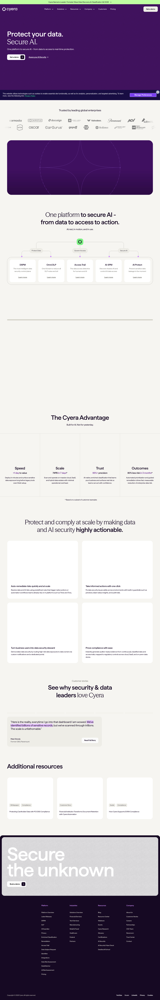

**Sections:**
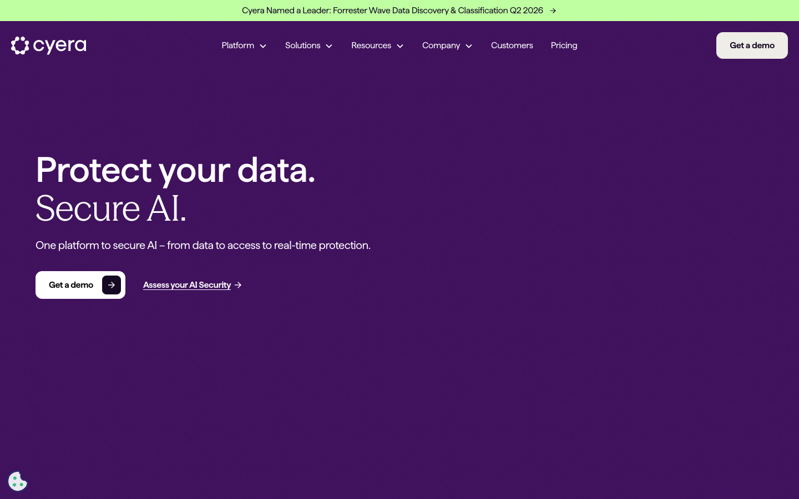
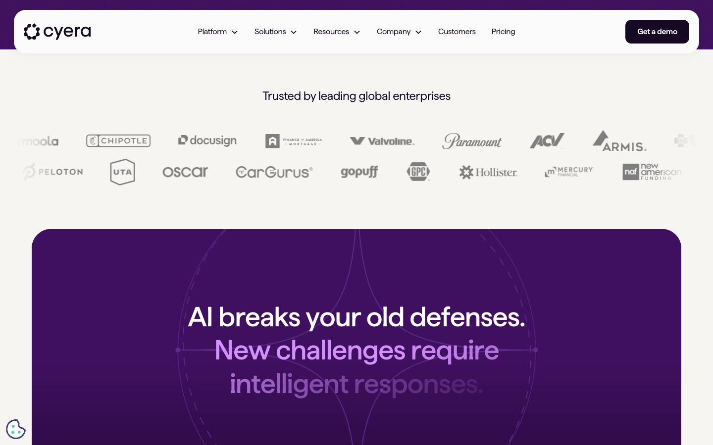
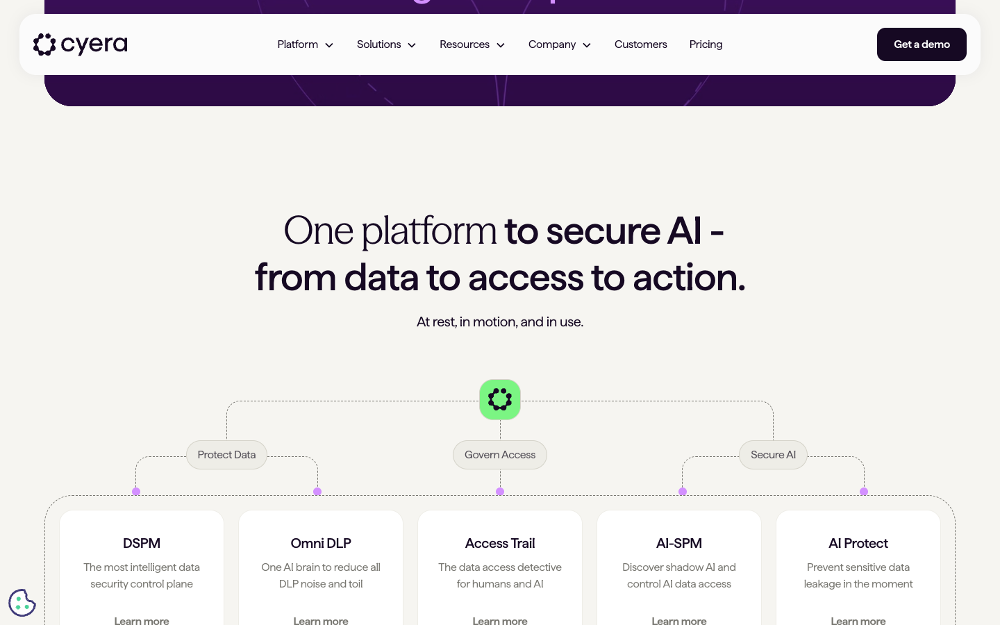
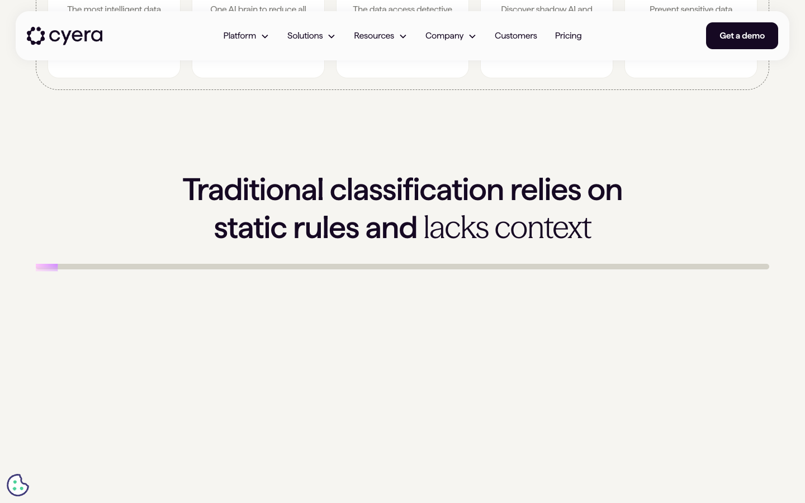
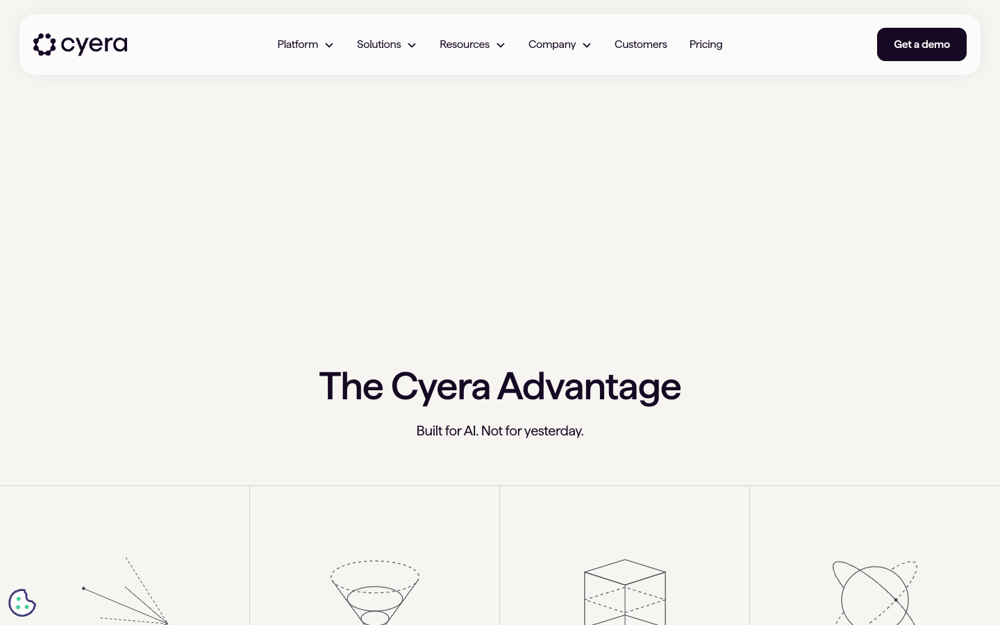
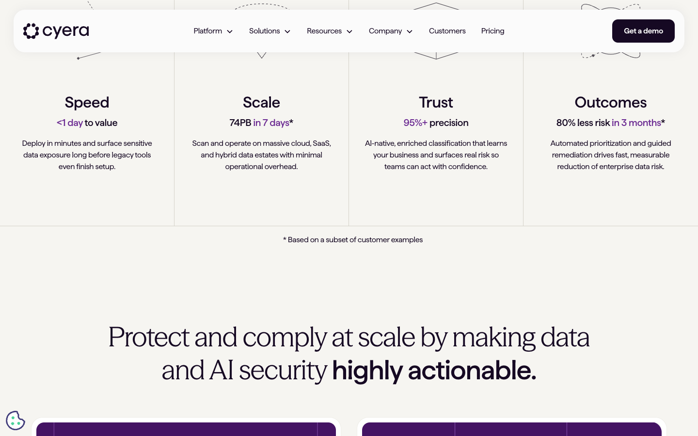
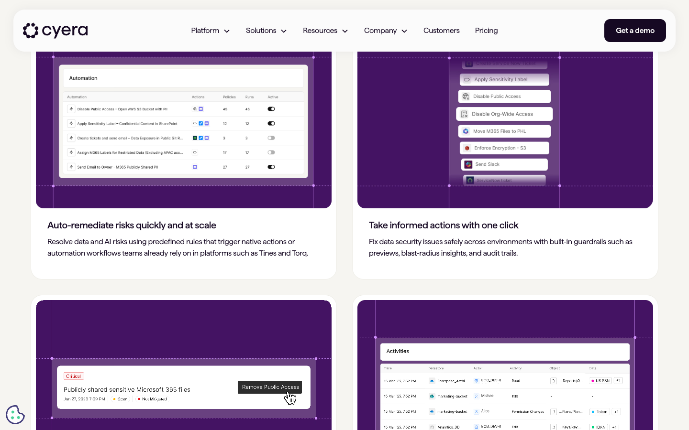
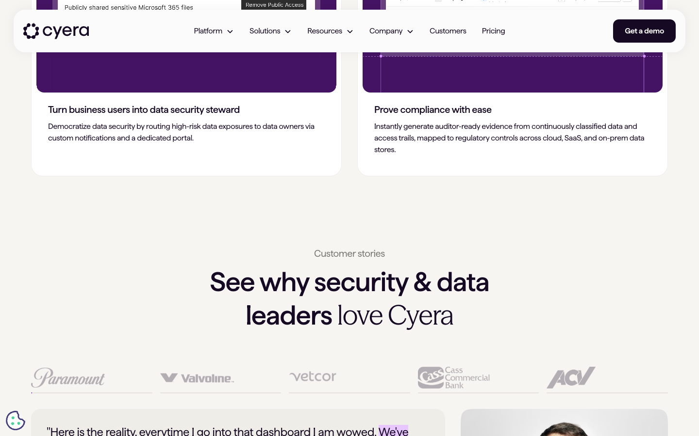
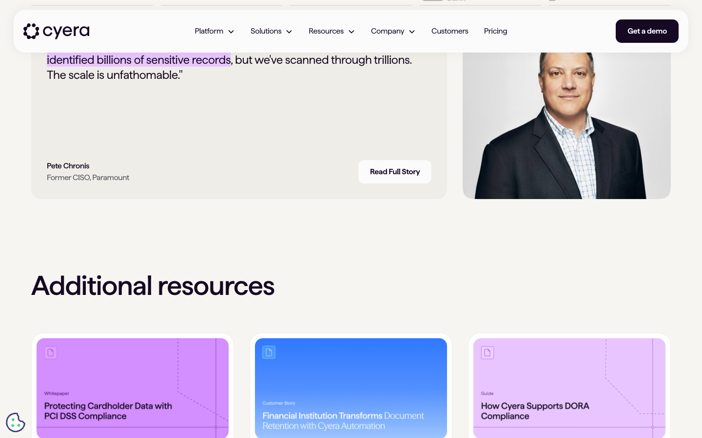
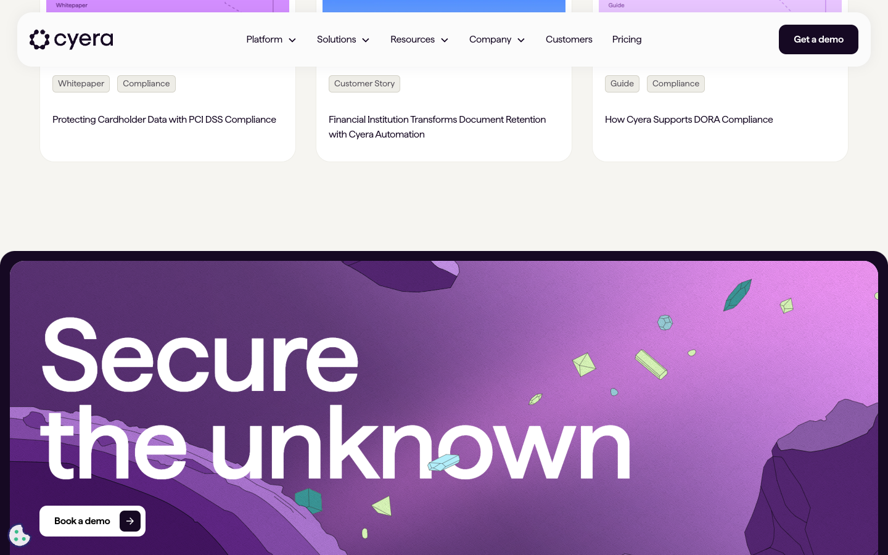
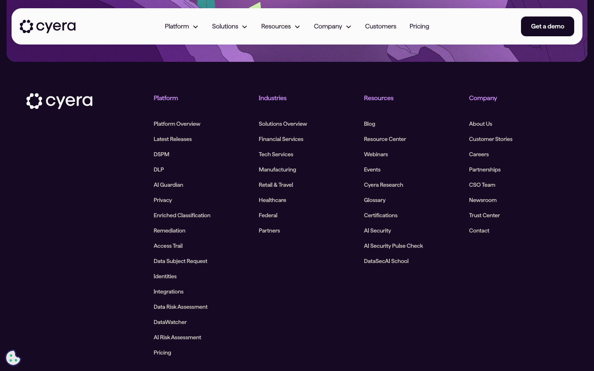
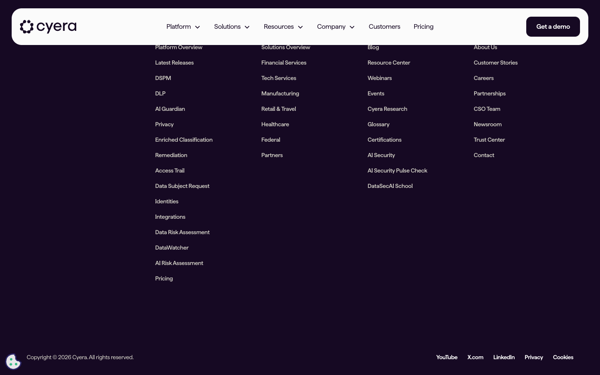

---

## 10 Decode Prompts

Paste this report into Claude with any of these prompts depending on what you want to learn:

| Prompt file | What you get |
|-------------|-------------|
| `prompts/pmm_decode.md` | Positioning, ICP, messaging, GTM motion, brand identity |
| `prompts/frontend_decode.md` | Exactly HOW animations are built, timing, easing, SVG techniques, how to rebuild |
| `prompts/design_decode.md` | Illustration style, color theory, composition, design-copy harmony, how to replicate |
